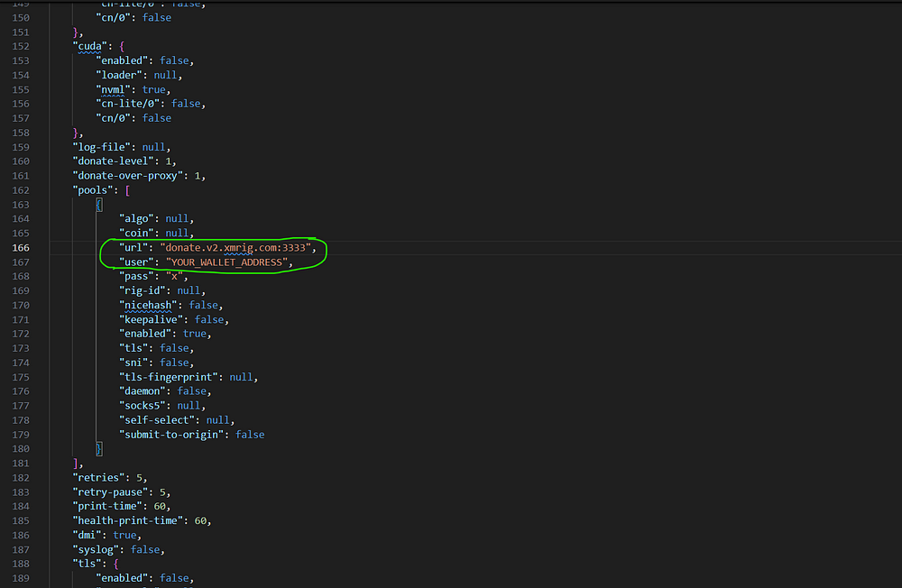
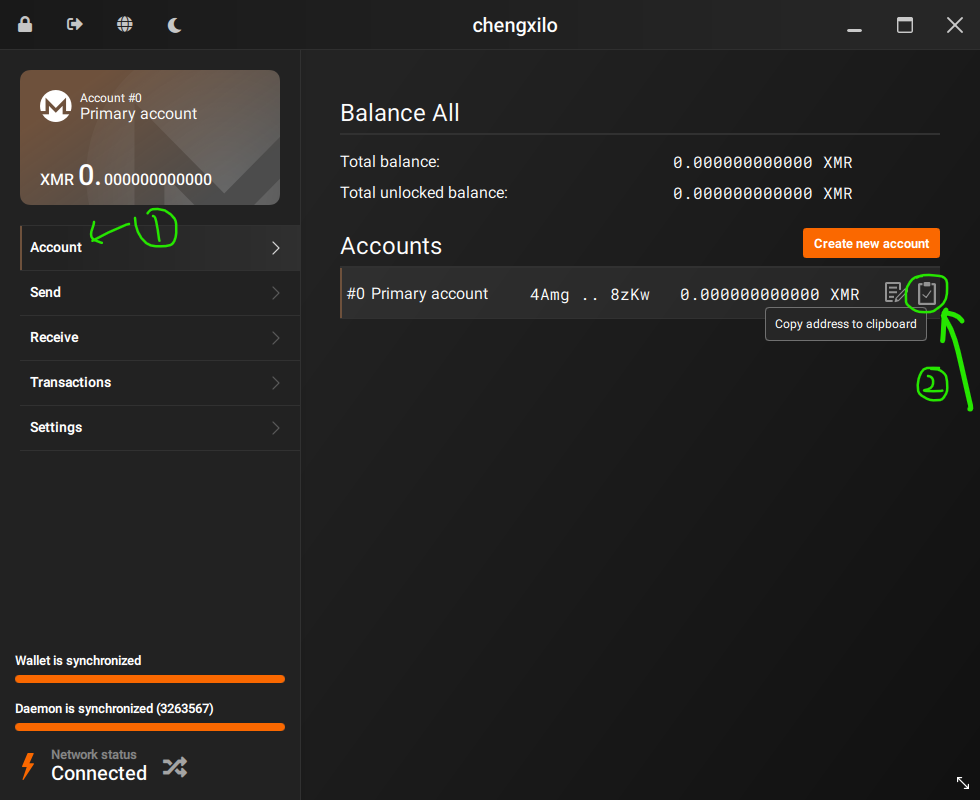
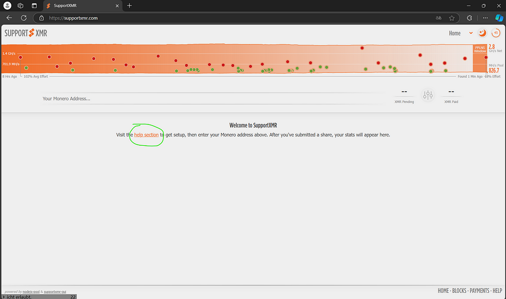
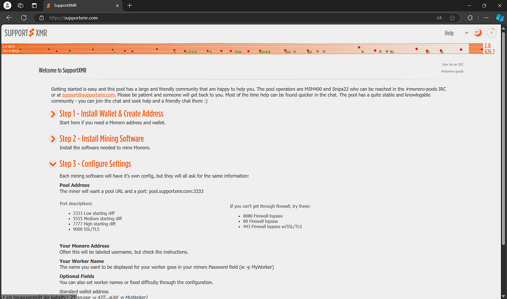
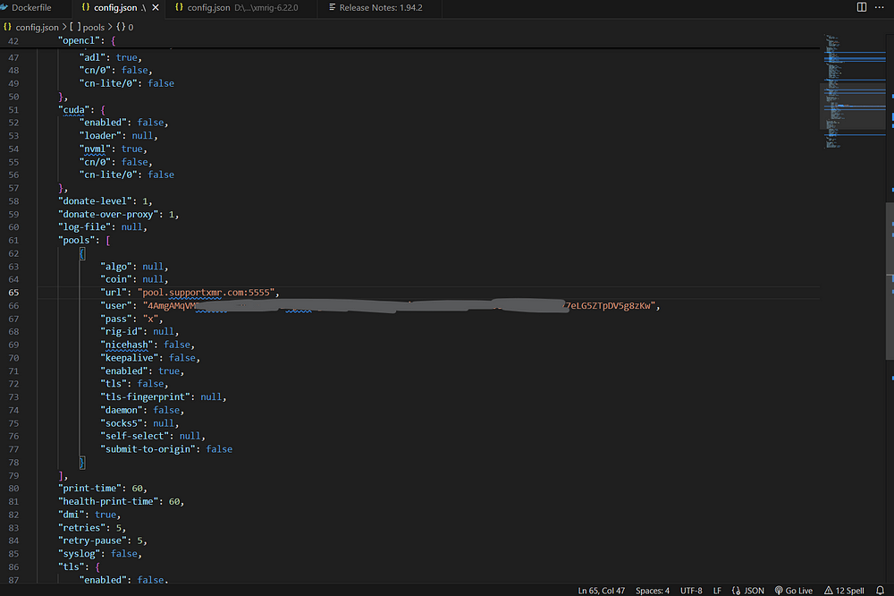
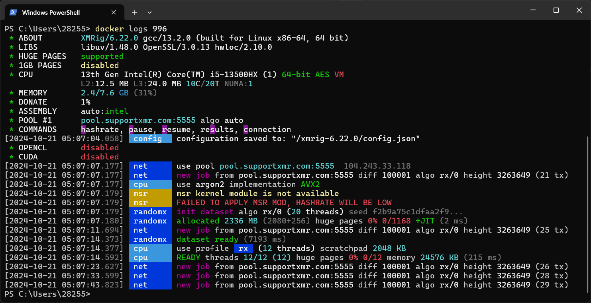

# monero-mine

It is a docker image for monero mining.

Before building, please change the two circled variables. The url should be the pool you are using, and the user should be your monero address.

The value of `user` should be replaced with your own monero address,you can find it according to the steps below.


The value of `url` can be got from mining pools in <https://miningpoolstats.stream/monero>. You just need to choose a pool you like. For me, I will choose <https://supportxmr.com/>. Because it is very easy to setup.Follow the steps below.

click help action to get setup.


pay attention to step 3-Configure Settings


This is a example for a correct config file.


And after configuration, you can build and run this image easily.

```shell
# build an image called monero-mine
docker build -t monero-mine .
```

```shell
# run the image
docker run -d monero-mine
```

Here is some problem about this image. It failed to apply MSR mod.😣 It might because we didn't run it in container which might be more likely to be considered as a virtual machine.


Official mining tutorial of monero:<https://www.getmonero.org/get-started/mining/>
